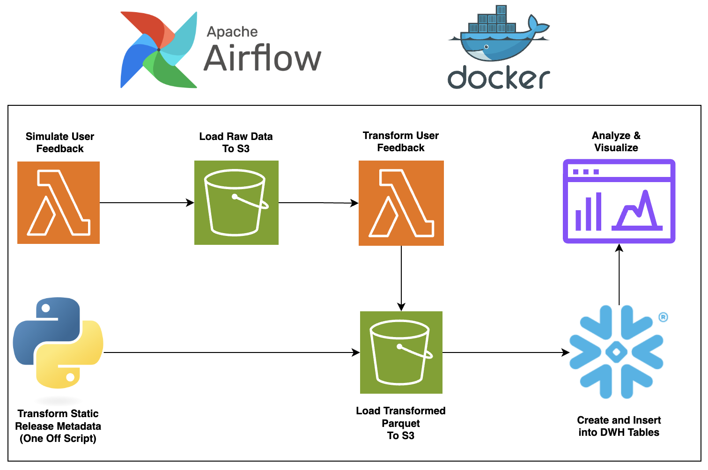
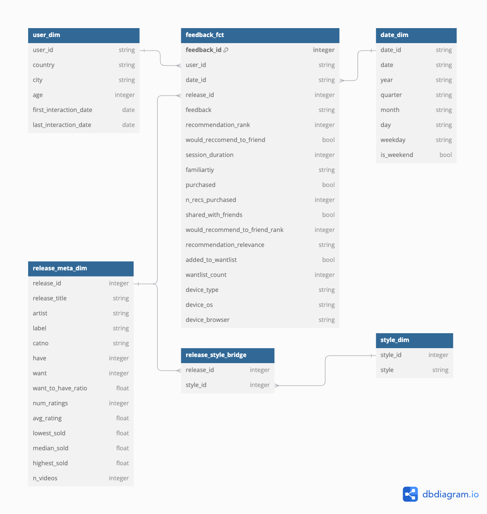

# Discogs Rec Pipeline

The Discogs Rec Pipeline simulates synthetic user feedback data based on recommendations from the [discogs-rec app](https://github.com/justinpakzad/discogs-rec). Utilizing AWS Lambda, S3, Snowflake, and Airflow, the pipeline handles data generation, processing, and modeling to create a workflow for managing and analyzing user interaction data.

## Data Flow Diagram

## Repository Structure
- `airflow/`: Contains code related to Airflow.
- `src/`: Core project files, divided into:
  - `lambdas/`: AWS Lambda functions for data generation and transformation.
  - `scripts/`: Python scripts for transformations and utility functions.
  - `sql/`: SQL scripts for table creation, loading, and transformations.
  - `analytics`: Queries for analyzing user behaviour and recommendation feedback.

## Data Model

